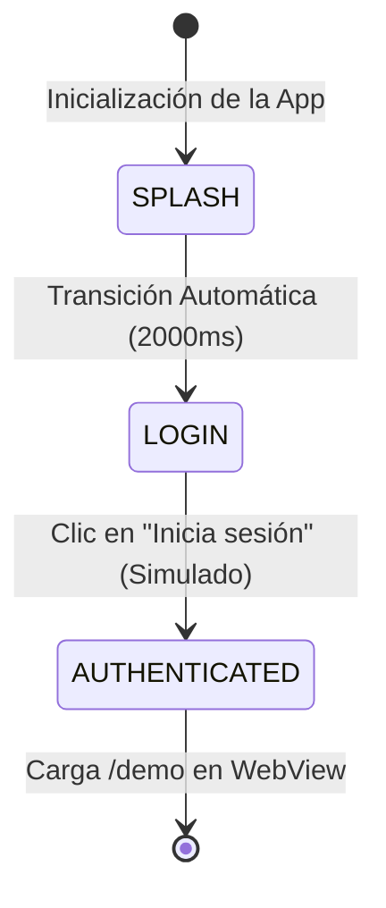
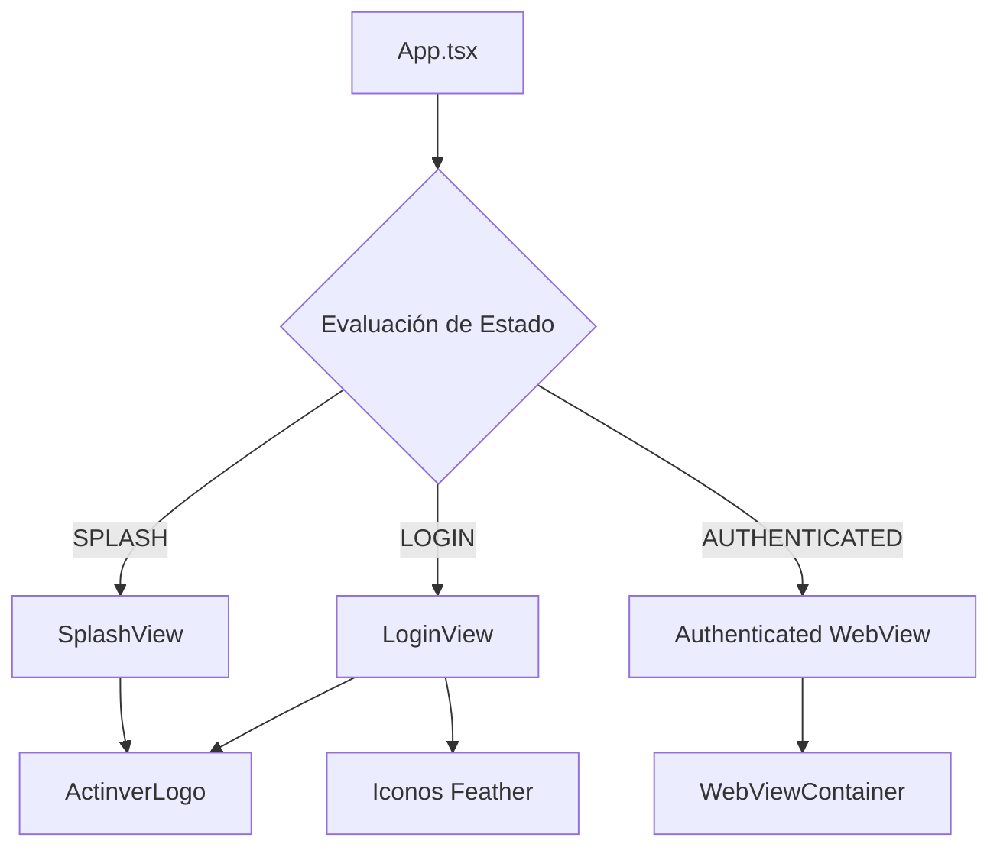

# Guía de Uso - Pantallas de Inicio y Acceso (Splash & Login)

Esta guía describe el funcionamiento, flujo y modo de interactuar con las nuevas pantallas de **Splash Screen** y **Login Screen** en la aplicación móvil de Actinver Trade (`apps/native`).

---

## 1. Arquitectura de Ciclo de Vida Móvil

La aplicación móvil implementa un motor de ciclo de vida visual conducido por estados (`'SPLASH' | 'LOGIN' | 'AUTHENTICATED'`) de manera determinista sin sobrecargar el código con dependencias de navegación externas.

### Diagrama de Estados de la Aplicación



### Flujo de Interacción y Jerarquía de Componentes



---

## 2. Descripción de Componentes

### 1. `ActinverLogo`

Un componente vectorial de alta fidelidad que dibuja la icónica letra **A** estilizada de Actinver (el chevron/caret azul oscuro con el punto teal central). Al estar dibujado de forma nativa con estilos responsivos, garantiza máxima nitidez en pantallas de alta densidad (Retina, AMOLED) sin requerir assets binarios externos.

### 2. `SplashView`

La pantalla de bienvenida de la marca. Se ejecuta inmediatamente al cargar la app:

- Muestra el logotipo de Actinver a escala y el texto institucional **Actinver Trade** con tipografía negrita y color azul corporativo.
- Tiene un temporizador no bloqueante de **2 segundos** (`2000ms`) que al expirar cambia el estado raíz a `LOGIN`.

### 3. `LoginView`

Formulario de acceso interactivo que cumple con las pautas de diseño y de accesibilidad de interfaces (regiones táctiles de al menos `44x44px`):

- **Correo electrónico**: Campo pre-rellenado con `cliente@ejemplo.com` para facilitar las pruebas de POC. Valida sintaxis básica de correo electrónico antes de proceder.
- **Contraseña**: Campo con visibilidad conmutable (ojo visible/oculto de Feather icons) para proteger el ingreso.
- **Ingresar con Face ID**: Botón para simular la autenticación biométrica del dispositivo. Al hacer clic, abre un modal de alerta confirmando el ingreso seguro y simulando credenciales de prueba.
- **Inicia sesión (CTA Principal)**: Botón de alta visibilidad que activa las validaciones del formulario y redirige al usuario.

### 4. `WebViewContainer`

Se activa en el estado `AUTHENTICATED`. Carga de manera dinámica la ruta `/demo` en el navegador embebido (ej. `http://localhost:8080/demo`), iniciando de inmediato la sesión interactiva con el asesor y avatar en vivo de Actinver.

---

## 3. Guía de Ejecución y Pruebas

Para arrancar el entorno móvil y visualizar el flujo completo:

### Paso 1: Iniciar el servidor local de desarrollo (Metro Bundler)

Desde la raíz del monorepo, ejecuta:

```bash
npm run start -w apps/native
```

### Paso 2: Ejecutar en el dispositivo o emulador

- **iOS Simulator**: Presiona `i` en la terminal o usa:
  ```bash
  npm run ios -w apps/native
  ```
- **Android Emulator**: Presiona `a` en la terminal o usa:
  ```bash
  npm run android -w apps/native
  ```
- **Dispositivo Real**: Escanea el código QR mostrado en la terminal utilizando la aplicación móvil **Expo Go** (disponible en App Store y Google Play).

### Paso 3: Flujo de Pruebas

1.  **Carga Inicial**: Observa cómo la aplicación carga inmediatamente la pantalla blanca con el logotipo y el texto central. Después de exactamente 2 segundos, transiciona de forma fluida a la pantalla de Login.
2.  **Validaciones de Formulario**:
    - Prueba borrar el correo y presionar **Inicia sesión**. Verás una alerta de error nativa.
    - Escribe un correo sin `@` para ver el error de formato inválido.
3.  **Conmutación de Contraseña**: Escribe una contraseña y presiona el ícono del ojo para revelar u ocultar los caracteres.
4.  **Acceso con Huella / Face ID**: Haz clic en "Ingresar con Face ID". Se desplegará un diálogo emergente simulando la lectura de biometría. Haz clic en "Ingresar" para pasar directamente a la demo.
5.  **Inicio de Sesión**: Deja los campos preestablecidos o ingresa credenciales válidas y haz clic en **Inicia sesión**. Verás un breve indicador de carga simulando la autenticación de red y luego la redirección automática a la interfaz interactiva `/demo`.
