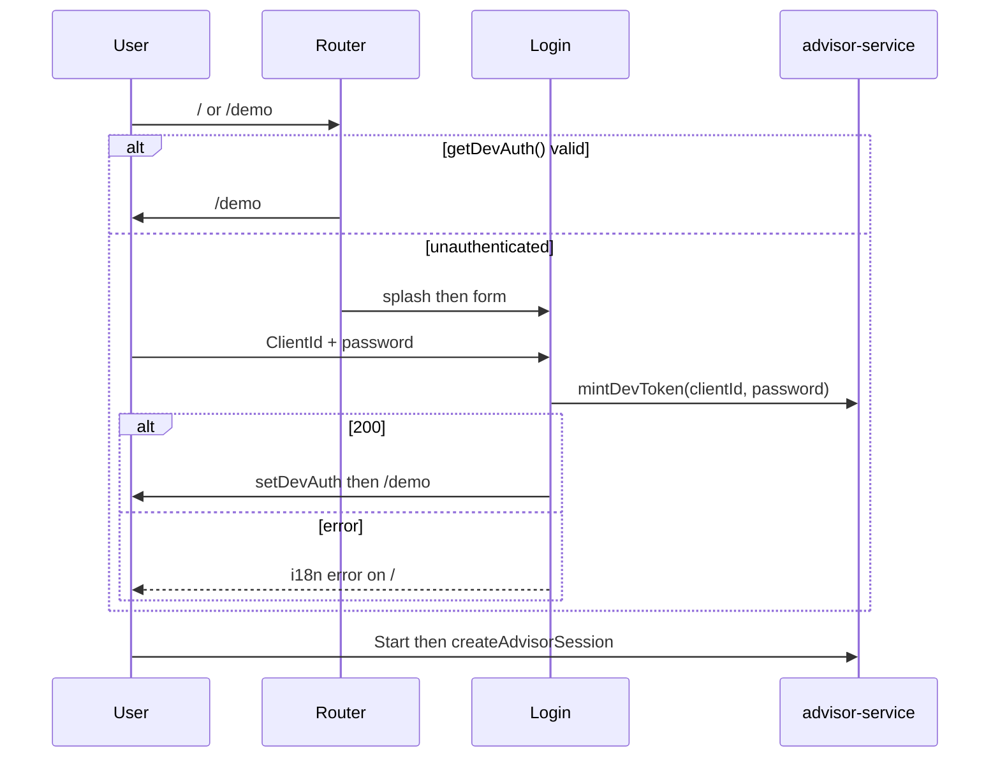

# Design: Add Login and Splash

## Technical Approach

Add `/` as the unauthenticated entry. `features/auth` owns a 1500ms navy/gold splash overlay and ClientId/password form. `beforeLoad` uses `getDevAuth()`. Login is the only mint site: `mintDevToken` POSTs `{ client_id, password }` from `apps/web/src/services/`. StartScreen keeps the session CTA and drops InvestorSelect. Specs were not on disk; this follows `proposal.md` and current code. Leave agent and Vite proxy unchanged.

## Architecture Decisions

| Decision | Options                                           | Tradeoff                             | Choice                                                                                                                                    |
| -------- | ------------------------------------------------- | ------------------------------------ | ----------------------------------------------------------------------------------------------------------------------------------------- |
| Splash   | Overlay on `/` vs `/splash` vs none               | Extra history vs first paint         | Overlay on `/`. Skip timer on `prefers-reduced-motion`. Valid token never paints `/`.                                                     |
| Guards   | `beforeLoad` + `redirect` vs login inside `/demo` | Router-owned vs mixed with session   | `beforeLoad`. Unauthenticated `/demo` → `/`. Authenticated `/` → `/demo`. Client-only. Vite proxy can still inject a bearer in local dev. |
| Identity | Login vs Start picker vs InvestorPicker remint    | Picker has no password               | Login only. Start and InvestorPicker stop minting.                                                                                        |
| ClientId | Digit string vs aliases                           | Agent accepts aliases; form does not | `inputMode="numeric"` (not `type="number"`). Trim. `/^\d+$/` before fetch.                                                                |
| Native   | WebView URI `/` vs keep `/demo`                   | Proposal text vs live code           | Keep `/demo`. Guard sends unauthenticated loads to `/`.                                                                                   |

## Data Flow



## File Changes

| File                                                         | Action    | Description                                                            |
| ------------------------------------------------------------ | --------- | ---------------------------------------------------------------------- |
| `apps/web/src/router.tsx`                                    | Modify    | `/` lazy login. `beforeLoad` on `/` and `/demo`.                       |
| `apps/web/src/features/auth/components/LoginScreen.tsx`      | Create    | Overlay + form in `AppShell`.                                          |
| `apps/web/src/features/auth/components/SplashOverlay.tsx`    | Create    | `bg-filled-dark` + gold `TinoMark` / `/tino-icon.png`.                 |
| `apps/web/src/features/auth/hooks/use-login-submit.ts`       | Create    | Trim, mint, `setDevAuth`, navigate, map errors.                        |
| `apps/web/src/features/auth/components/LoginScreen.test.tsx` | Create    | Splash skip, submit, errors, password not stored.                      |
| `advisor-service.ts` (+ test)                                | Modify    | `mintDevToken(clientId, password)` body `{ client_id, password }`.     |
| `packages/contracts/src/index.ts`                            | Modify    | `password` on `DevTokenRequestSchema`.                                 |
| `StartScreen.tsx` / `LiveSessionScreen.tsx` (+ tests)        | Modify    | Drop picker, mint, `useInvestors`.                                     |
| `InvestorPicker.tsx` (+ test)                                | Modify    | Stop remint (unused).                                                  |
| `es.json` / `en.json`                                        | Modify    | `auth.*` keys.                                                         |
| `dev-auth.ts`, `AppShell.tsx`, native, `services/agent`      | Unchanged | Token store, layout, WebView `/demo`, agent already requires password. |

## Interfaces / Contracts

```ts
DevTokenRequestSchema = { client_id: string, password: string, roles?: string[], ttl_s?: number }
mintDevToken(clientId: string, password: string): Promise<DevTokenResponse>
```

Login maps `ApiError.code`: `UNAUTHENTICATED` to `auth.error_unauthenticated`; `VALIDATION_ERROR` to `auth.error_validation`; else `auth.error_unknown`. Password stays in React state.

```ts
beforeLoad: () => {
  if (!getDevAuth()) throw redirect({ to: '/' });
};
```

## Testing Strategy

| Layer       | What to Test                                                      | Approach                  |
| ----------- | ----------------------------------------------------------------- | ------------------------- |
| Unit        | Password in body; schema; digit ClientId; error map               | vitest                    |
| Integration | Token stored, password not; splash skip; Start has no picker/mint | RTL + jsdom               |
| Router      | See SPA guard RED tests below                                     | vitest + `RouterProvider` |
| E2E         | None                                                              | No web e2e                |

## Threat Matrix

SPA `beforeLoad` is a routing boundary, so the matrix is included.

| Boundary                 | Minimum adversarial cases                                                  | Applicability                                            | Design response | Planned RED tests |
| ------------------------ | -------------------------------------------------------------------------- | -------------------------------------------------------- | --------------- | ----------------- |
| Documentation-like paths | `requirements.txt`, `CMakeLists.txt`, executable Markdown/MDX, `README.sh` | N/A: no file classification. Routes are `/` and `/demo`. | n/a             | none              |
| Git repository selection | `git -C`, relative paths, absolute paths                                   | N/A: no git cwd selector.                                | n/a             | none              |
| Commit state             | staged, `commit -a`, empty index                                           | N/A: no commit automation.                               | n/a             | none              |
| Push state               | tracking branch, first push, explicit refspec                              | N/A: no push automation.                                 | n/a             | none              |
| PR commands              | `--head`, env prefix, composed commands                                    | N/A: no PR command composition.                          | n/a             | none              |

SPA guards (not matrix rows). Safe: redirect, no mint. Failure: stay on `/demo` or start without login.

| Case                     | RED test                                 |
| ------------------------ | ---------------------------------------- |
| Unauthenticated `/demo`  | No `getDevAuth` → location `/`           |
| Authenticated `/`        | Stored token → `/demo`                   |
| Expired token            | `expiresAt` in the past → `/`            |
| Native deep link `/demo` | Same redirect. Native URI stays `/demo`. |

## Migration / Rollout

No migration. Stored tokens stay valid until `expiresAt`. Rollback: revert frontend and contracts. `/demo` returns to unguarded Start.

## Open Questions

- [ ] Specs missing at design time. Align delta specs with this file when they land.
